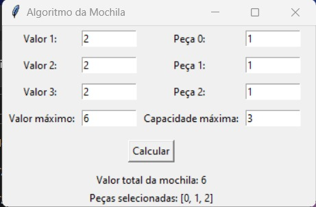
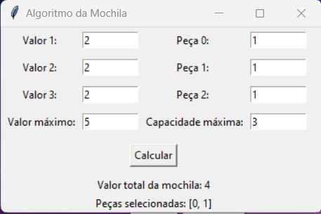
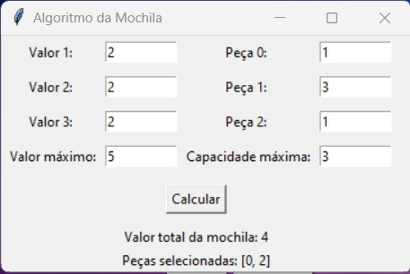

# Motor Sport

**Número da Lista**: 10 
**Conteúdo da Disciplina**: Programação Dinâmica 

## Alunos
|Matrícula | Aluno |
| -- | -- |
| 20/0043536  |  Silas Neres de Souza|
| 20/2017521  |  Algusto Rodrigues Caldas |

## Sobre 
Um algoritmo da mochila relacionado a peças de carro com seus respectivos pesos e valores, tendo uma capacidade e um valor limite imposto pelo própio usuário.

## Screenshots

Exemplo 1

Exemplo 2

Exemplo 3

## Instalação 
**Linguagem**: Python 
**Framework**: Tkinter   
Necessário ter uma versão atualizada da linguagem Python (Preferência 3.10) e, além disso, instalar o framework xxx (Use o comando: pip install). 

## Uso 
Preencher o número dos valores, e o peso das peças, e respectivamente o valor máximo e capacidade máxima

## Outros 
None
